# Azure Databricks Training - Medicare Capstone Project

- This databricks training project is showcased using an [Azure Free account](https://azure.microsoft.com/en-us/pricing/purchase-options/azure-account) as of 8th September, 2025.

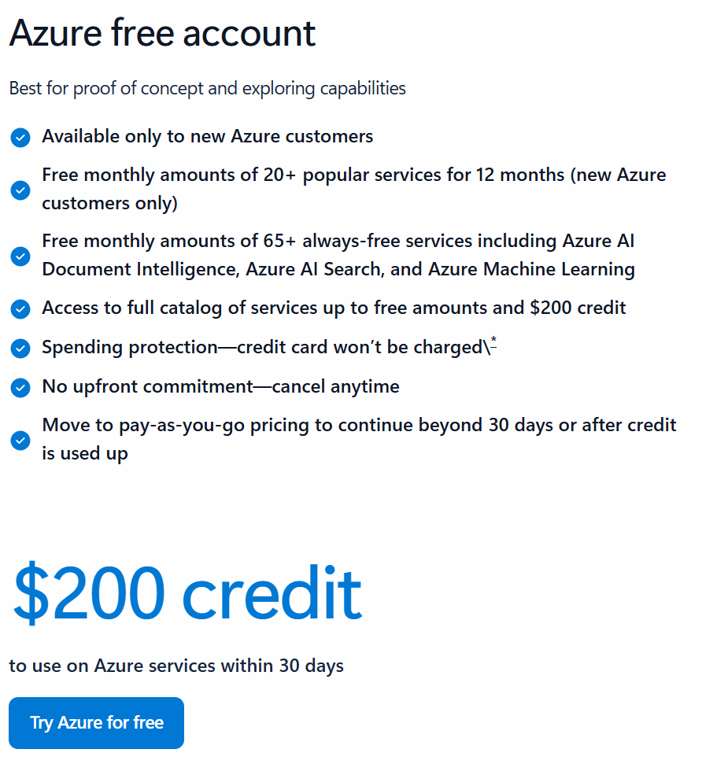

## Problem Statement - Healthcare Claims Quality & Compliance Platform (Databricks Lakehouse)

- MediSure, a national healthcare insurer, ingests claims and reference data from heterogeneous sources (batch CSV files, streaming EHR events, JDBC legacy systems, and nested JSON provider directories).
- The current estate suffers from long processing delays (often >24 hours), pervasive data-quality defects (duplicates, invalid codes, mismatched member/provider IDs), fragmented analytics, and limited auditability/governance—creating operational inefficiency, fraud exposure, and compliance risk.
- The organization needs a governed, near-real-time claims platform on the Databricks Lakehouse to standardize ingestion, enforce quality rules, enable ACID time-travel/rollback, and deliver reliable analytics for fraud scoring and regulatory reporting.

The full problem statement is described at [Capstone Project Statement - Healthcare Claims Quality & Compliance Platform.pdf](<problem/Capstone Project Statement - Healthcare Claims Quality & Compliance Platform.pdf>).

## Repository Structure

```text
databricks-training
├── .github
│   ├── workflows
│   ├── deploy-databricks.yml
├── data
│   ├── claims_batch.csv
│   ├── claims_stream.json
│   ├── diagnosis_ref.csv
│   ├── members.csv
│   └── providers.json
├── docs
│   ├── images
│   └── architecture.md
├── functions
│   └── utils.py
├── notebooks
│   ├── claims_batch.py
│   ├── claims_stream.py
│   ├── create_uc_objects.py
│   ├── diagnosis.py
│   ├── members.py
│   └── providers.py
├── problem
│   └── Capstone Project Statement - Healthcare Claims Quality & Compliance Platform.pdf
├── resources
│   ├── 00_job_medisure_init.yml
│   └── 01_job_medisure_orchestrate.yml
├── setup
│   ├── 01_create_resource_groups.ps1
│   ├── 02_create_storage.ps1
│   ├── 03_create_databricks.ps1
│   ├── 04_create_azure_sql.ps1
│   ├── 05_create_databricks_connector.ps1
│   ├── 06_create_storage_container.ps1
│   ├── 07_create_key_vault.ps1
│   ├── 08_create_databricks_objects.ipynb
│   ├── 09_load_members_to_azure_sql.ipynb
│   └── azure-cli-usage.md
├── .gitignore
├── config.yml
├── databricks.yml
├── poetry.lock
├── pyproject.toml
└── README.md
```

### Repo Description

- **data**/: sample inputs for batch/stream (claims, members, providers, diagnosis).

- **docs**/: project docs and diagrams.

- **functions**/: reusable Python helpers imported by notebooks.

- **notebooks**/: lakehouse pipelines by file type to manage end to end

- **problem**/: capstone problem statement.

- **resources**/: Databricks Jobs YAML (init + orchestration).

- **setup**/: Infrastructure as Code scripts (PowerShell + notebooks) to provision Azure (RG, ADLS, Databricks, SQL, Key Vault) and load seed data.

- **Root files**: project config (config.yml, databricks.yml), packaging (pyproject.toml, poetry.lock), and repo docs (README.md).

## Getting Started

I used VSCode as my IDE to develop and run the setup scripts.

### 1. Clone the repo

```bash
git clone https://github.com/bank-r/databricks-training.git
cd databricks-training
```

### 2. Setup environment using Poetry

[Poetry](https://python-poetry.org/docs/) is a tool for dependency management and packaging in Python. It allows you to declare the libraries your project depends on and it will manage (install/update) them for you. Poetry offers a lockfile to ensure repeatable installs, and can build your project for distribution.

```bash
poetry install
```

This will create a new environment based on all dependencies declared with poetry.

### 3. Using the environment with your notebooks for setup

For more info refer to [VSCode Docs](https://code.visualstudio.com/docs/datascience/jupyter-kernel-management#_python-environments)

### 4. Install az cli for infrastructure powershell scripts

Download the [Azure CLI for Windows](https://learn.microsoft.com/en-us/cli/azure/install-azure-cli-windows?view=azure-cli-latest&pivots=zip)

### 5. Install ODBC Driver for SQL Server

Download the [ODBC Driver for SQL Server](https://learn.microsoft.com/en-us/sql/connect/odbc/download-odbc-driver-for-sql-server?view=sql-server-ver17). The one natively installed with windows is obsolete.

## Set up Azure & Databricks resources

Assuming free account has been created with a new subscription
> Infrastructure as code under folder setup/

1. create resource groups
2. create storage account
3. create databricks workspace
4. create azure sql to store member.csv data
5. create databricks connector allow databricks to access storage account
6. create storage container for landing and managed delta files used by unity catalog
7. create key vault to store secrets
8. create databricks objects
   1. credentials (access to adls gen2 container)
   2. external location (define access to adls gen2 container via volume)
   3. secrets (secure access to get password of azure sql)
   4. service principals (github sp to deploy and workflow sp to run jobs)
   5. tokens (grant github service principal access to workspace from github)
9. load member.csv data into azure sql to simulate jdbc connection

## Macro Architecture

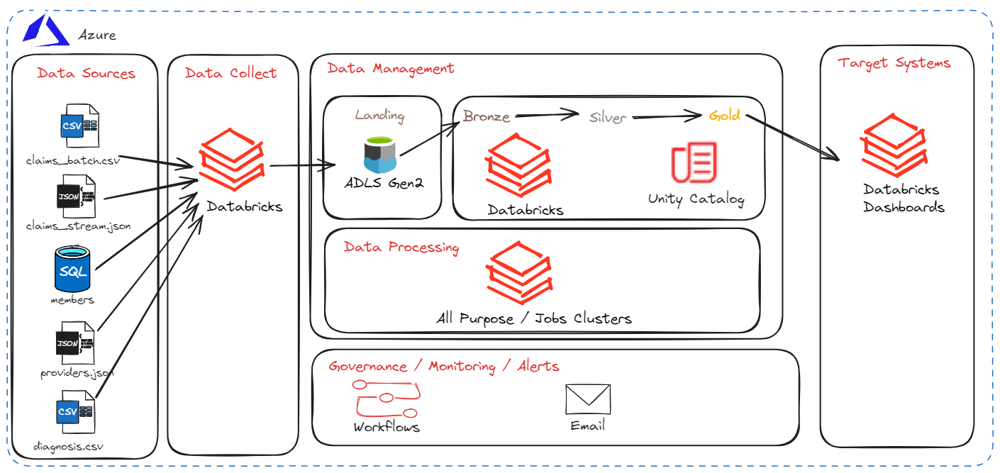

## High level ETL Workflow

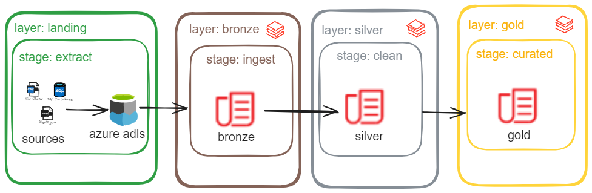

## Unity Catalog

- Organized by schema
  - bronze
    - raw
  - silver
    - clean
  - gold
    - analytics
  - ops
    - for autoloader checkpoints, schemas, streams

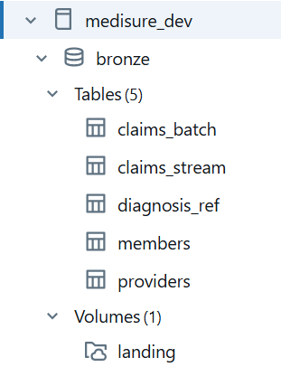
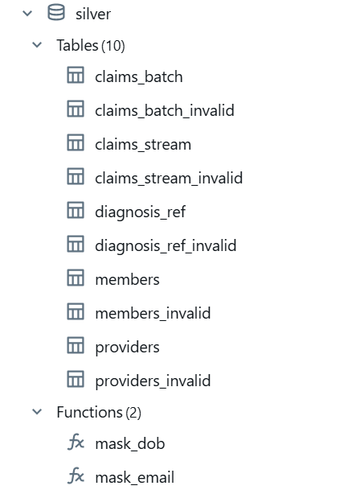
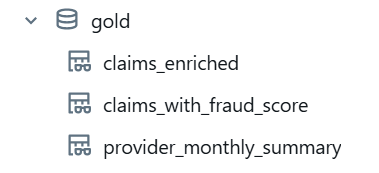


## Data Lineage

- bronze tables have metadata fields to show file name and ingest date

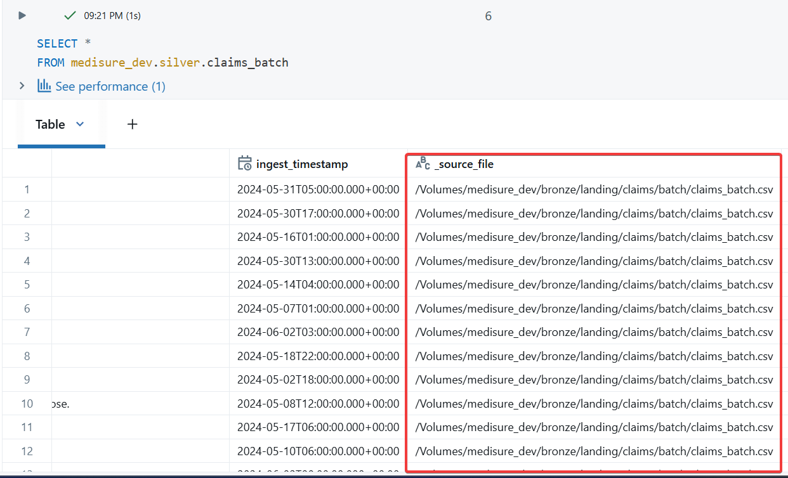

## Data Quality

Overview of the raw files

- claims_batch.csv – 500 rows with 13 columns: ClaimID, MemberID, ProviderID, ClaimDate, ServiceDate, Amount, Status, ICD10Codes (semicolon‑separated), CPTCodes (semicolon‑separated), ClaimType, SubmissionChannel, Notes and IngestTimestamp. ClaimID duplicates (~193 duplicates) must be deduplicated using the latest IngestTimestamp.

- claims_stream.json – newline‑delimited JSON; each record has ClaimID, MemberID, ProviderID, ClaimDate, Amount, Status, ICD10Codes, CPTCodes and EventTimestamp. Duplicates (~186) should be deduped using the latest EventTimestamp.

- diagnosis_ref.csv – mapping of ICD‑10 codes to descriptions. Codes should be trimmed/upper‑cased and unique.

- members.csv – 500 members with MemberID, Name, DOB, Gender, Region, PlanType, EffectiveDate, Email, IsActive and LastUpdated. IsActive is 0/1; a few emails are missing; there are no duplicate MemberIDs.

- providers.json – newline‑delimited JSON; each record has ProviderID, Name, Specialties (array), Locations (array of objects with Address, City, State), IsActive, TIN and LastVerified. No duplicate ProviderIDs, but the nested arrays must be exploded and flattened.

- Invalid data are isolated in a dedicated table
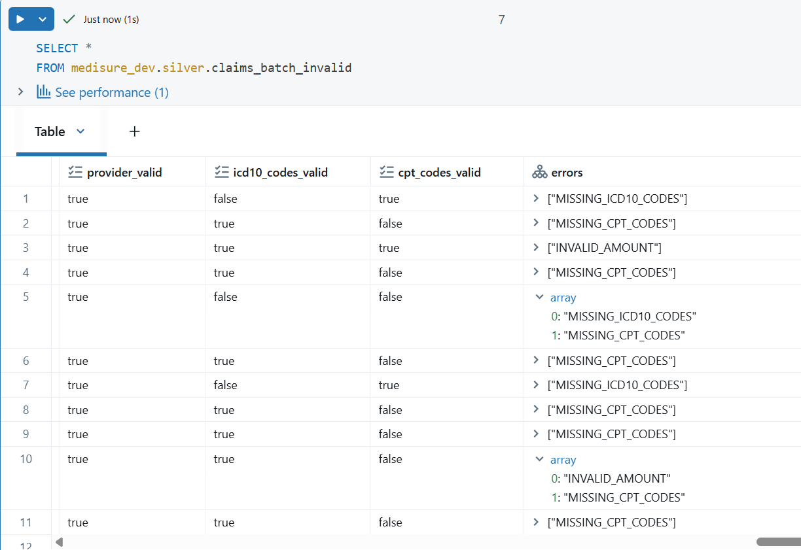

## Security

- Unity Catalog Grants
  - analysts only have access to gold schema
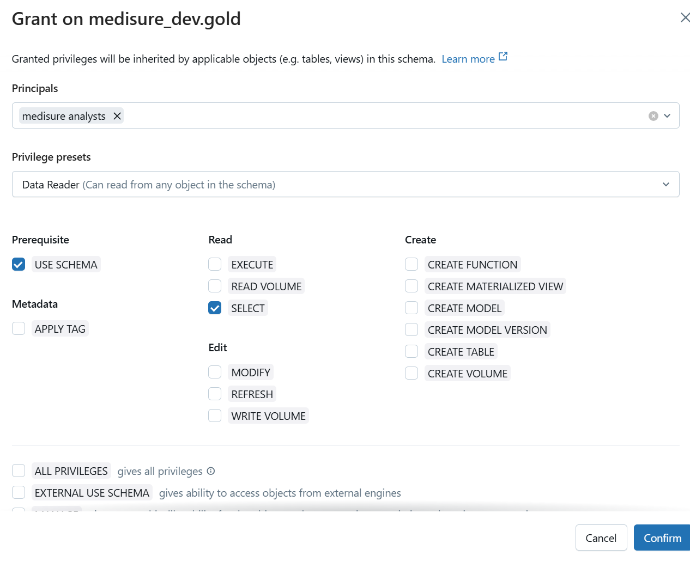
- Masking member emails
  - only admins with elevated rights can see PII data.

```sql
CREATE OR REPLACE FUNCTION medisure_dev.silver.mask_email(email STRING)
  RETURN CASE
           WHEN is_member('admins') THEN email
           ELSE
             CONCAT(
               SUBSTRING(email, 1, 1),
               '*****',
               SUBSTRING(email, instr(email, '@'))
             )
         END;

-- Apply the mask to the email column of the members table.
ALTER TABLE medisure_dev.silver.members
ALTER COLUMN email SET MASK medisure_dev.silver.mask_email;

-- Mask DOB to the first day of the same year for non-admins
CREATE OR REPLACE FUNCTION medisure_dev.silver.mask_dob(dob DATE)
  RETURN CASE
           WHEN dob IS NULL THEN NULL
           WHEN is_member('admins') THEN dob
           ELSE make_date(year(dob), 1, 1)   -- stays a DATE
         END;

-- Apply it to the members table (adjust column name if needed)
ALTER TABLE medisure_dev.silver.members
ALTER COLUMN dob SET MASK medisure_dev.silver.mask_dob;
```

## Github CI/CD & Databricks Asset Bundles

- [Databricks Asset Bundles](https://learn.microsoft.com/en-us/azure/databricks/dev-tools/bundles/) are used to manage deployment of code and resources.
- Using service principal **github deploy - dev** and its token.
- [databricks.yml](databricks.yml) is the configuration file for Databricks Asset Bundles
- [deploy-databricks.yml](.github\workflows\deploy-databricks.yml) is the configuration file for GitHub actions
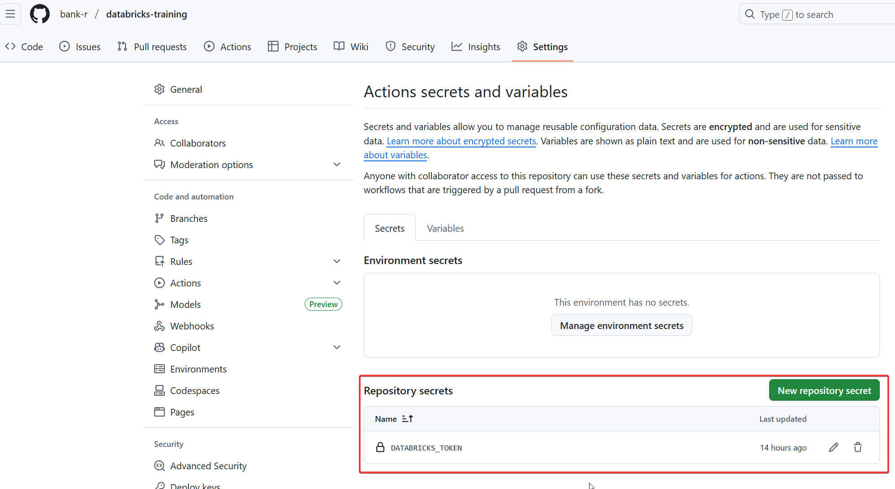
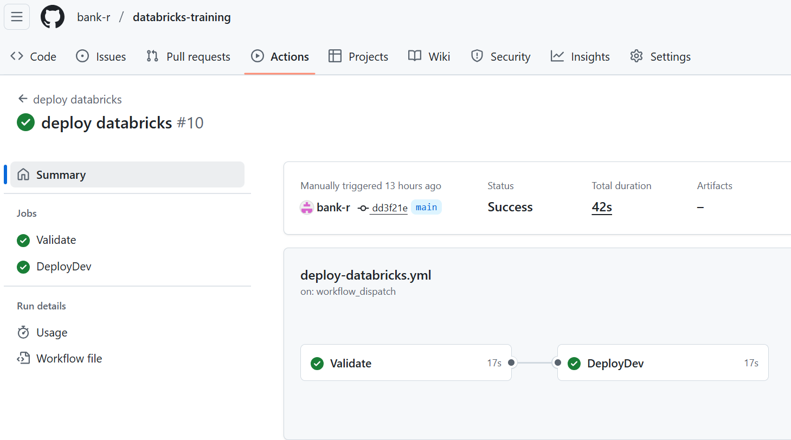

## Databricks Jobs

- Schedule
  - every minute instead of continuous
- Alerting
  - When job fails, email alert is sent.
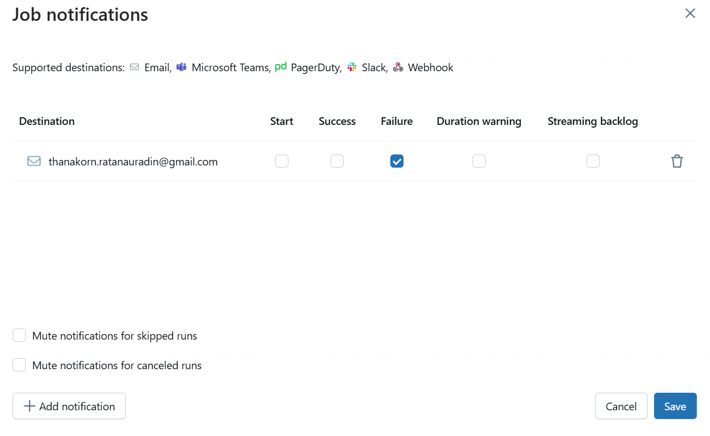
- Retry
  - When job fails, it retries immediately 3-4 times (managed by serverless auto-optimization)

## Analytics

- Examples:

> Fraud Analysis by Plan

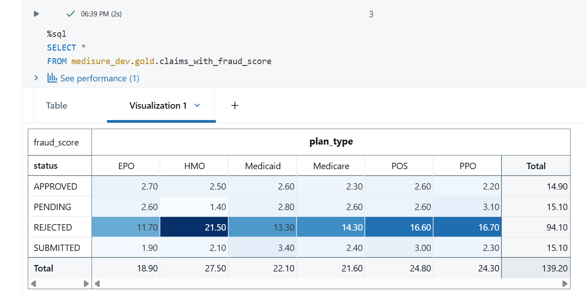

> Count by Provider_Id

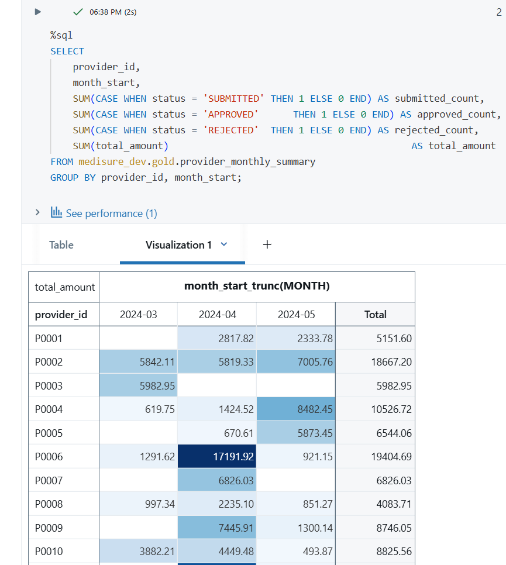

> Amount by Month

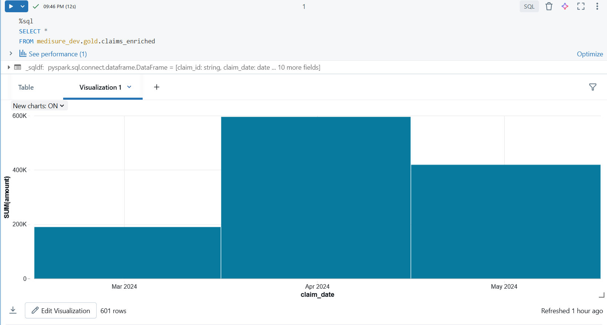
